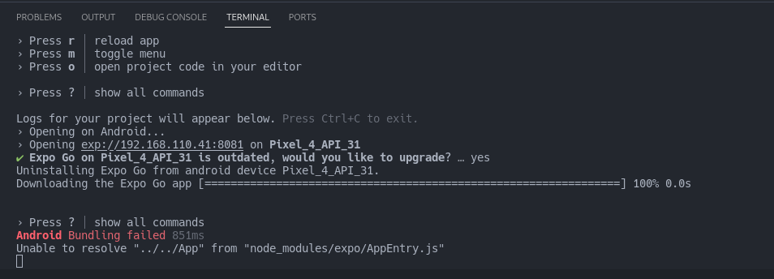
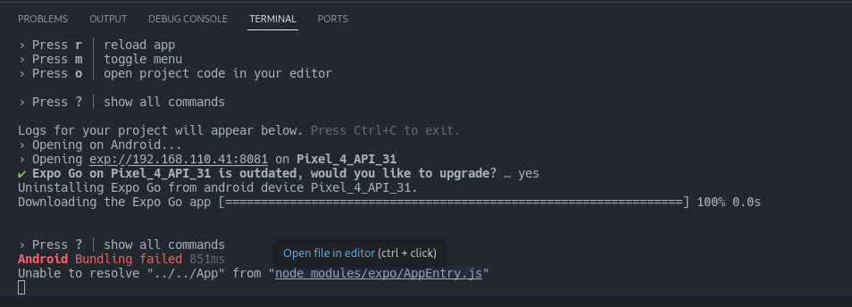

# ignite Teams

Projeto desenvolvido na Trilha React Native do Ignite.

# primeiro passo clonar o projeto

# Segundo passo instalar as dependências

npm install ou npm i

# obs: como eu mudei o App da raiz do projeto pra dentro da pasta src vai ter que seguir o passo a passo abaixo para que o projeto roda sem problemas

# Se o erro for este aqui abaixo!

1° passo dar um click para abrir o arquivo

2° passo a clicar ele vai abrir a página onde o arquivo vai esta assim
[Terceiro Passo](src/assets/ImagensError/Terceiro.png)

3° passo altera os dados conforme a imagem abaixo e salva as alterações. E para o serviços e rodar o projeto novamente que já vai funcionar perfeitamente.
[Quarto Passo](src/assets/ImagensError/Quarto.png)
